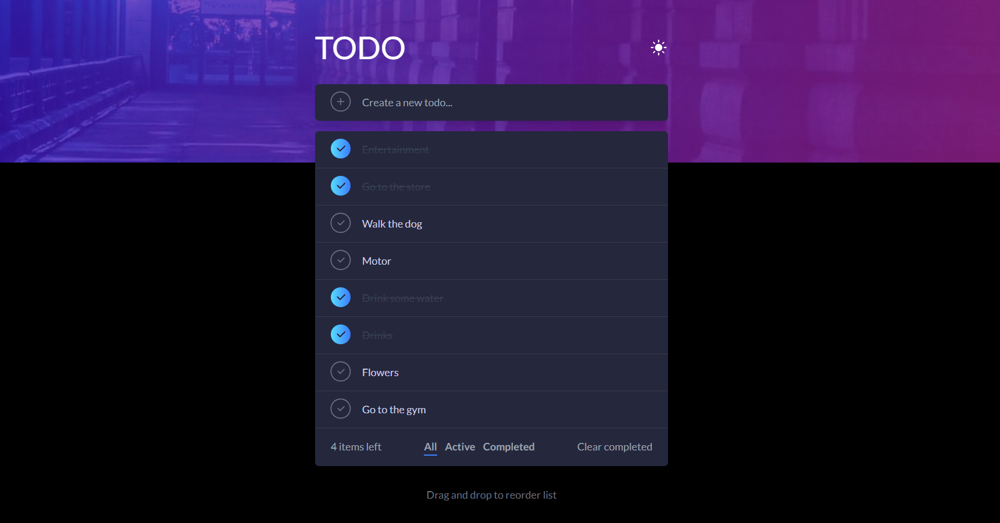

# TodoApp

Welcome to TodoApp, a modern and dynamic solution designed to help you manage your tasks efficiently and stylishly. Built with the latest technology stack including Next.js 14, Tailwind CSS, MongoDB, and enhanced with features like dark mode and drag-and-drop functionality, TodoApp stands out as your ultimate tool for personal organization and productivity.

## Features:

-Interactive Web Experience: Utilizing the power of Next.js 14, TodoApp offers a fast, interactive web application that's both user-friendly and efficient.

-Elegant UI with Tailwind CSS: With Tailwind CSS, the app boasts a clean, maintainable, and scalable user interface that's easy to customize and pleasant to use.

-CRUD Operations: Comprehensive create, read, update, and delete functionality, allowing for full control over your todo list.

-MongoDB Integration: Secure and scalable database management with MongoDB, ensuring reliable data storage and retrieval.

-Dark Mode: A user-friendly dark mode to reduce eye strain and improve readability in low-light conditions.

-Drag-and-Drop: Intuitive drag-and-drop interface for easy task prioritization and management.

### FrontendMentor Challenge:

[https://www.frontendmentor.io/challenges/todo-app-Su1_KokOW](https://www.frontendmentor.io/challenges/todo-app-Su1_KokOW)

### Demo:

[https://todo-app-nextjs14-mongodb.vercel.app/](https://todo-app-nextjs14-mongodb.vercel.app/)

### FrontendMentor Profile:

[https://www.frontendmentor.io/profile/Ronaldodev03](https://www.frontendmentor.io/profile/Ronaldodev03)
